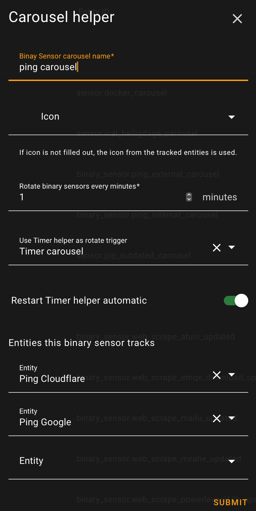

# Carousel helper

The Carousel helper integration allows you to create a binary_sensor or sensor which rotate through a set of the same type of entities with a user defined time interval. if the binary_sensors/sensors set has the same attribute, it's possible to use cards which support showing attributes.

For installation instructions until the Carousel helper is part of HACS, [see this guide](https://hacs.xyz/docs/faq/custom_repositories).

## Configuration

Configuration is setup via UI in Home assistant. To add one, go to [Settings > Devices & Services > Helpers](https://my.home-assistant.io/redirect/helpers) and click the add button. Next choose the [Carousel helper](https://my.home-assistant.io/redirect/config_flow_start?domain=carousel) option.

<!--  -->

 
 

It's possible to synchronize the rotation between multiple carousels by using the optional same Timer helper. Restarting the Timer helper can be done via the Carousel helper or via an automation

## Services

Available services: __add__, __remove__, __show_entity__, __show_next__ and __show_prev__

### Service carousel.binary_sensor_add/carousel.sensor_add

Add entity to Carousel helper.

### Service carousel.binary_sensor_remove/carousel.sensor_remove

Remove entity from Carousel helper.

### Service carousel.binary_sensor_show_next/carousel.sensor_show_next

Show next entity in Carousel helper.

### Service carousel.binary_sensor_show_prev/carousel.sensor_show_prev

Show previous ext entity in Carousel helper.
