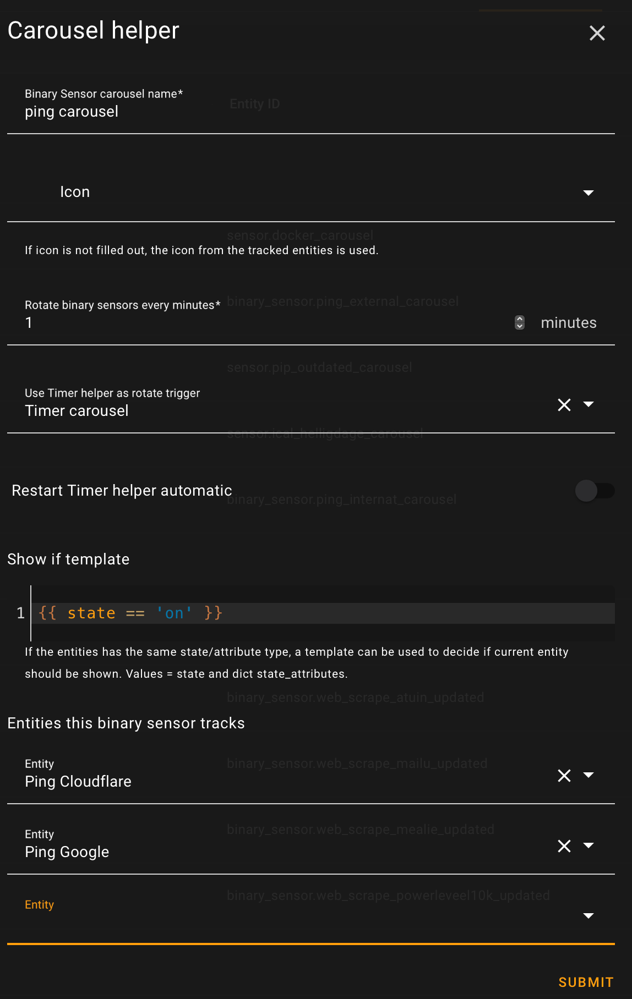

# Carousel helper

The Carousel helper integration allows you to create a binary_sensor or sensor which rotate through a set of binary_sensors/sensors with a user defined time interval. if the binary_sensors/sensors set has the same attribute, it's possible to use cards which support showing attributes.

For installation instructions until the State updated helper is part of HACS, [see this guide](https://hacs.xyz/docs/faq/custom_repositories).

## Configuration

Configuration is setup via UI in Home assistant. To add one, go to [Settings > Devices & Services > Helpers](https://my.home-assistant.io/redirect/helpers) and click the add button. Next choose the [State updated helper](https://my.home-assistant.io/redirect/config_flow_start?domain=carousel) option.

 

| Field name | Mandatory/Optional | Description |
|------------|------------------|-------------|
| Name | Optional | Name. If empty, entity id name are used  |
| Entity id | Mandatory | Entity that this sensor tracks  |
| Attribute | Optional | Attribute of entity that this sensor tracks  |
| Icon | Mandatory | Icon used by entity  |
| Clear updates after | Mandatory | User defined time period indicating when to clear the entity  |
| Text template | Optional | Defines a template to create the text state attribute. Value = new_value, old_value, entity_id, attribute and last_updated |

## Exposed state attributes

The state updated helper integration provides the following state attributes.

| Attribute | Description |
|-----------|-------------|
| new_value  | New state/state_attribute value |
| old_value  | Old state/state_attribute value |
| text  | Text generated from template |
| last_updated  | Last time the state/state_attribute was updated |

## Services

Available services: __reset__ and __reset_all__.

### Service state_updated.reset

Reset a specific State Updated entity.

|Service data attribute | Optional | Description|
|-----------------------|----------|------------|
|entity_id | No | Name of the State updated entity to take reset.|

### Service state_updated.reset_all

Reset all State updated entities.

## Usage scenario

Using the Scrape integration for retrieving latest software version. By letting the State updated helper monitor the Scrape entity, a card can be built that only shows when there are changes and a content about what has changed.
